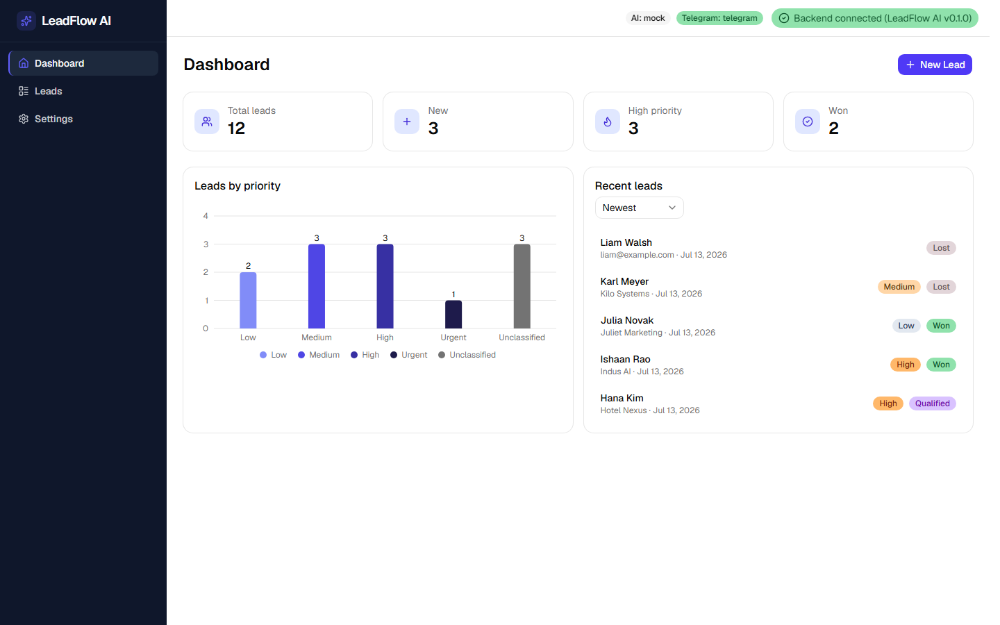
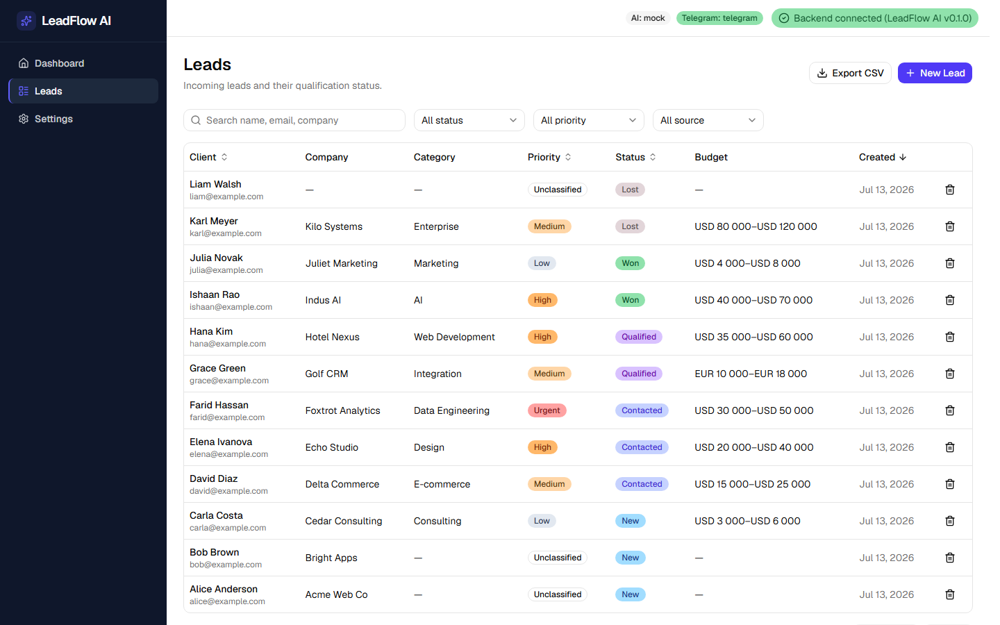
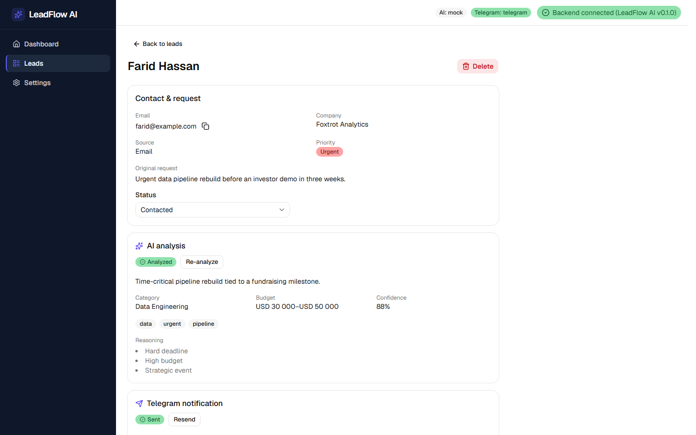
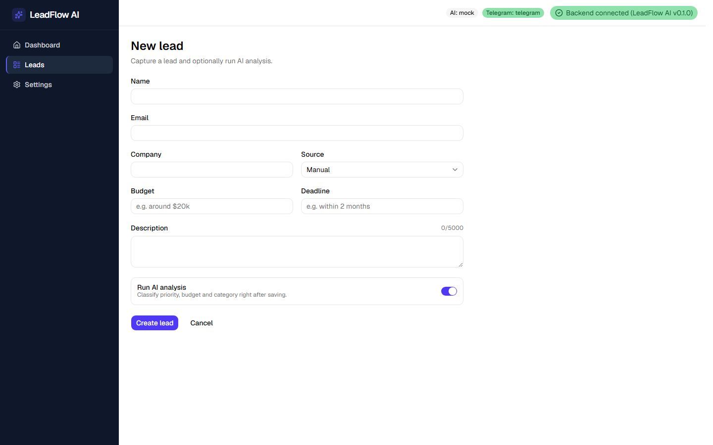
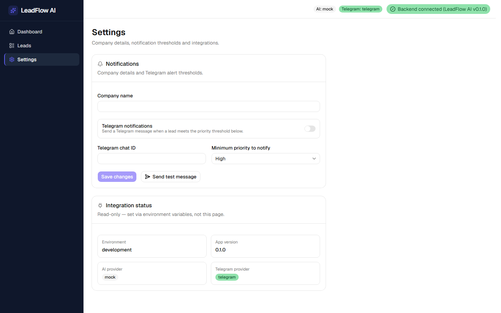
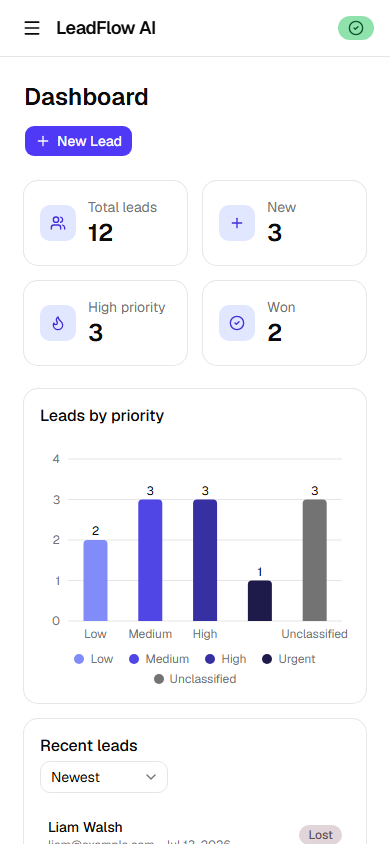
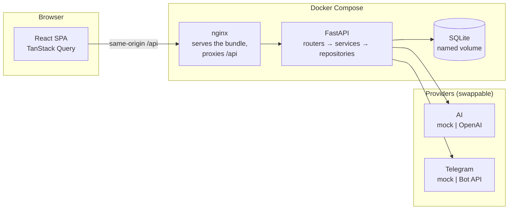

<div align="center">

# LeadFlow AI

**AI-powered lead qualification dashboard — classify, prioritize and never miss a high-value enquiry.**

[](https://github.com/tellaboutme/LeadFlow/actions/workflows/ci.yml)
[](https://github.com/tellaboutme/LeadFlow/actions/workflows/security.yml)
[](LICENSE)


Incoming leads are classified by an LLM — priority, budget, category, recommended action —
and the ones that clear a configurable threshold trigger a Telegram alert.

**Runs entirely on mock providers by default**: `docker compose up` gives you a working app
with seeded demo data — no external API calls, no API keys.



</div>

---

## Table of contents

- [Features](#features)
- [Architecture](#architecture)
- [Quick start](#quick-start)
- [Configuration](#configuration)
- [Testing and quality](#testing-and-quality)
- [Security](#security)
- [Demo video](#demo-video)
- [Project layout](#project-layout)
- [License](#license)

---

## Features

- 🤖 **AI lead analysis** — classifies each lead into a category and priority, extracts a budget range and deadline, writes a summary and a recommended action, and returns tags plus its reasoning with a confidence score.
- 📣 **Telegram alerts** — automatically notifies on leads at or above a configurable priority threshold. Re-analysing a lead never re-sends a duplicate alert.
- 📋 **Leads workspace** — searchable, filterable, sortable, paginated list (including an *unclassified only* filter); a validated creation form; and a detail view with status changes, analysis retry and manual notification.
- 📊 **Dashboard** — totals, conversion rate, a priority-distribution chart and a sortable recent-leads list, all clickable through to a filtered list.
- 📤 **CSV export** — respects the filters currently applied, Unicode-safe, with an optional BOM for Excel and a formula-injection guard.
- ⚙️ **Settings** — company name, Telegram threshold and chat ID, a test-message button, and read-only integration status.

| | |
|---|---|
|  |  |
| **Leads list** — search, filters, sorting | **Lead details** — AI analysis and notification state |
|  |  |
| **New lead** — validated form | **Settings** — thresholds and integration status |

<p align="center">
  
  <br><em>Responsive down to 375px</em>
</p>

---

## Architecture



The browser only ever talks to one origin: nginx serves the production bundle
and proxies `/api` to the backend, so there is no CORS in the deployed stack.

Both integrations sit behind an interface with a **mock implementation that is
the default**. The mock is deterministic, makes no network calls, and is what
the tests and the demo run on — swapping in the real OpenAI or Telegram
provider is a config change, not a code change.

| Layer | Stack |
|---|---|
| **Backend** | FastAPI · SQLAlchemy 2 · Alembic · Pydantic v2 · uv |
| **Frontend** | React 19 · TypeScript (strict) · Vite · Tailwind v4 · shadcn/ui · TanStack Query + Table · React Hook Form + Zod · Recharts |
| **API contract** | Types generated from the backend's OpenAPI schema — CI fails if they drift from the code |

---

## Quick start

### Docker (recommended)

Needs only Docker. No local Python, Node, `.venv` or `node_modules`.

```bash
docker compose up --build
```

Open **http://localhost:8080**. The demo leads are seeded on first boot.

If port 8080 is taken, set `FRONTEND_PORT` in `.env` (e.g. `FRONTEND_PORT=8081`).

| Command | Purpose |
|---|---|
| `docker compose ps` | Service status and health |
| `docker compose logs -f backend` | Follow the API logs |
| `docker compose down` | Stop, keeping the database |
| `docker compose down -v` | Stop and reset the database |

### Local development

Needs Python 3.12 + [uv](https://docs.astral.sh/uv/), and Node 22.

```bash
cp .env.example .env
cd backend  && uv sync   && uv run alembic upgrade head && uv run python -m app.db.seed
cd frontend && npm install
```

Then run the backend (`uv run uvicorn app.main:app --reload`) and the frontend
(`npm run dev`, http://localhost:5173). The dev server proxies `/api`, so this
is same-origin too.

---

## Configuration

Everything is driven by `.env` (see `.env.example`). The three modes:

| Mode | `AI_PROVIDER` | `TELEGRAM_PROVIDER` | Behaviour |
|---|---|---|---|
| **Mock** (default) | `mock` | `mock` | No network calls. Deterministic analysis; notifications are recorded, not sent. This is what CI and the demo use. |
| **Real AI** | `openai` | `mock` | Calls the OpenAI API (needs `OPENAI_API_KEY`). |
| **Real both** | `openai` | `telegram` | Also delivers via the Telegram Bot API (needs `TELEGRAM_BOT_TOKEN`). |

Secrets live in `.env` only. Docker Compose passes through just the variables it
names and never mounts `.env` into a container.

---

## Testing and quality

| Suite | Coverage |
|---|---|
| Backend | 78 tests, 96% statement coverage (pytest, Ruff, mypy `strict`) |
| Frontend | 92 tests (Vitest + Testing Library, plus Storybook stories run in a real browser) |
| End-to-end | 10 Playwright tests against the **production build**, on an isolated DB with mocked providers |
| Accessibility | axe-core on all five pages — zero critical or serious WCAG 2 A/AA violations |
| Security | CodeQL, Trivy (filesystem + both images), dependency review, pip/npm audit, OWASP ZAP, SBOMs |

```bash
cd backend  && uv run ruff check . && uv run mypy app/ && uv run pytest
cd frontend && npm run typecheck && npm run lint && npm test && npm run build
cd frontend && npm run e2e          # then: npm run e2e:report
```

CI runs all of this on every pull request, always against mock providers — it
never reaches a real external API.

---

## Security

Both containers run as **non-root**. nginx sets a Content-Security-Policy plus
`X-Content-Type-Options`, `X-Frame-Options`, `Referrer-Policy`,
`Permissions-Policy` and the cross-origin isolation headers. The CSV export
guards against spreadsheet formula injection, and lead text is treated as
untrusted input to the LLM (there is a test asserting that instructions embedded
in a lead's description do not change its classification).

### Honest limitations

This is a **single-user demo**, and it is important to be straight about what
that means:

- **There is no authentication or authorisation.** Anyone who can reach the app
  can read and modify every lead. Do not expose it to the internet or put real
  personal data in it.
- **SQLite, single writer.** Fine for a demo; not sized for concurrent
  production traffic.
- **No rate limiting** on the API, and secrets come from `.env` rather than a
  secret manager.
- The backend relies on the nginx proxy for some response headers rather than
  setting them itself.
- The CSP needs `style-src 'unsafe-inline'` because Radix and Recharts set inline
  style attributes at runtime.
- Base-image CVEs that have **no fix available** are reported but do not fail the
  build; fixable ones do.

Authentication and PostgreSQL are the planned next step.

---

## Demo video

_Placeholder — link to be added._

---

## Project layout

```
backend/     FastAPI app (routers → services → repositories), Alembic migrations, tests
frontend/    React SPA, Storybook stories, Playwright E2E specs
docs/        Product scope, technical spec, API/data notes, decisions, changelog
.github/     CI and security workflows
```

---

## License

[MIT](LICENSE)
